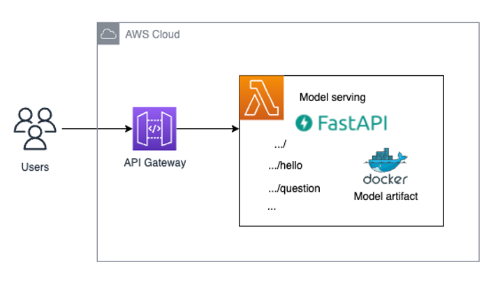
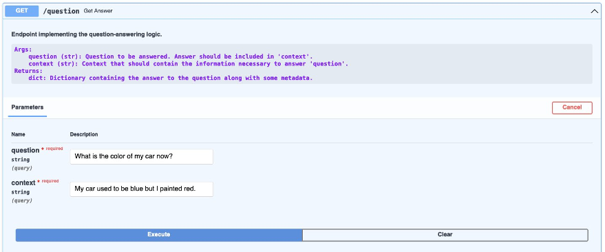

# Deploy an ML serverless inference endpoint using FastAPI, AWS Lambda and AWS CDK

## Architecture


## Prerequisites

Have Python3 installed, along with virtualenv for creating and managing virtual environments in Python.
Install `aws-cdk v2` on your system in order to be able to use the aws-cdk CLI.
Have Docker installed (and, for the deployment part, running!) on your local machine.

### Test if all necessary software is installed:

AWS CLI is needed. Login to your account and select the region where you want to deploy the solution.

Python3 is needed. For this solution, we use Python3.8. Make sure that the Python version you use locally is consistent with the Python version specified in the Dockerfile.
```shell
python3 --version
```

Check if virtualenv is installed for creating and managing virtual environments in Python. Strictly speaking, this is not a hard requirement, but it will make your life easier and helps following this blog post more easily.
```shell
python3 -m virtualenv --version
```

Check if cdk is installed. This will be used to deploy our solution.
```shell
cdk --version
```

Check if Docker is installed. Our solution will make your model accessible through a Docker image to your lambda. For building this image locally, we will need Docker.
```shell
docker --version
```
Also make sure it is up and running by running ```docker ps```.

## How to structure your FastAPI project using AWS CDK

We are using the following directory structure for our project (ignoring some boilerplate cdk code that is immaterial in the context of this blog post):

```
fastapi_model_serving
│   
└───.venv  
│
└───fastapi_model_serving
│   │   __init__.py
│   │   fastapi_model_serving_stack.py
│   │   
│   └───model_endpoint  
│       └───docker
│       │      Dockerfile
│       │      serving_api.tar.gz
│       │  
│       └───runtime
│            └───serving_api
│                    requirements.txt  
│                    serving_api.py
│                └───custom_lambda_utils
│                     └───model_artifacts
│                            ...
│                     └───scripts
│                            inference.py
│  
└───templates
│   └───api
│   │     api.py    
│   └───dummy
│         dummy.py
|
└───scripts
│   └───init-lambda-code.sh
│   └───setup.sh
│   └───update_notice.sh
│      
│   app.py
│   cdk.json
│   README.md
│   requirements.txt
 
```

The directory follows the recommended structure of cdk projects for Python. 

The most important part of this repository is the ```fast_api_model_serving``` directory. It contains the code that will define the cdk stack and the resources that are going to be used for model serving.

`model_endpoint` directory:
- contains all the assets necessary that will make up our serverless endpoint, i.e., Dockerfile to build the Docker image that AWS Lamdba will use, as well as the lambda function code that uses FastAPI to handle inference requests and route them to the correct endpoint, and the model artifacts of the model that we want to deploy.

Inside model endpoint, we have the follwing struture... 
- `docker` directory:
    - which specifies a `Dockerfile` which is used to build the image for the Lambda function with all the artifacts (Lambda function code, model artifacts, ...) in the right place so that they can be used without issues.
    - `Serving.api.tar.gz`: this is a tarball that contains all the assets from the runtime folder that are necessary for building the Docker image. More on how to create the tar.gz. file later in the next section.
- `runtime` directory:
    - contains the code for the `serving_api` Lambda function and it’s dependencies specified in the `requirements.txt` file
    - as well as the `custom_lambda_utils` directory which includes an `inference` script that loads the necessary `model artifacts` so that the model can be passed to the `serving_api` that will then expose it as an endpoint


Besides, we have the `template` directory which provides you with a template of folder structure and files where you can define your customised codes and APIs following the sample we went through above.

- `template` directory: contains dummy code that can be used to create new lambda functions from 
    - `dummy` contains the code that implements the structure of an ordinary AWS Lambda function using the Python runtime
    - `api` contains the code that lambda that implements an AWS Lambda function that wraps a FastAPI endpoint around an existing API Gateway


## Step-by-step walk-through: Deploying the solution

NOTE: By default, the code is going to be deployed inside the eu-west-1 region. If you want to change the region to another region of your choice, you can change the `DEPLOYMENT_REGION` context variable in the `cdk.json` file.
Beware, however, that the solution tries to deploy a lambda on top of the arm64 architecture, and that this feature might not be available in all regions at the time of your reading. In this case, you need to change the “architecture” parameter in the fastapi_model_serving_stack.py file, as well as the first line of the Dockerfile inside the model_endpoint > Docker directory, to host this solution on the x86 architecture.


1)  First, run the following command to clone the git repository:
`git clone https://github.com/aws-samples/lambda-serverless-inference-fastapi`
Since we would like to showcase that the solution could work with model artifacts that you train locally, we contain a sample model artifact of a pretrained DistilBERT model on the Hugging Face model hub for question answering task in the `serving_api.tar.gz` file. Hence, the downloading time can take around **3 to 5 minutes**. 

2) Now, let’s setup the environment to recreate the blog post. This step will download the pretrained model that will be deployed from the huggingface model hub into the `./model_endpoint/runtime/serving_api/custom_lambda_utils/model_artifacts` directory. It will also create a virtual environment and install all dependencies that are needed. You only need to run this command once:
```shell 
make prep
```
This command can take around **5 minutes** (depending on your internet bandwidth) because it needs to download the model artifacts.


3) The model artifacts need to be packaged inside a .tar.gz archive that will be used inside the docker image that is built in the cdk stack. You will need to run this code whenever you make changes to the model artifacts or the API itself to always have the most up-to-date version of your serving endpoint packaged:
```shell
make package_model
```
Finally, the artifacts are all in-place. Now we can move over to deploying the cdk stack to your AWS account.


4) ```FIRST TIME CDK USERS ONLY```: If this is your first time deploying an AWS CDK app into an environment (account + region combination), you will need to bootstrap the environment, i.e., prepare it for use with `CDK`. This will create a stack that includes resources that are needed for the toolkit’s operation. For example, the stack includes an S3 bucket that is used to store templates and assets during the deployment process.
```shell
make cdk_bootstrap
```

5) Since we are building docker images locally in this cdk deployment, we need to ensure that the docker daemon is running before we are going to be able to deploy this stack via the cdk CLI. To check whether or not the docker daemon is running on your system, use the following command:
```shell
docker ps
```
If you don’t get an error message, you should be good to deploy the solution. 


6) Deploy the solution with the following command:
```shell
make deploy
```
This step can take around **5-10 minutes** due to building and pushing the docker image.

## Running real-time inference

### Using the API documentation in the browser
After your `AWS CloudFormation` stack got deployed successfully, go to the `Outputs` section and open up the shown endpoint url. Now, our model is accessible via the endpoint url and we are ready to use it for real-time inference!

1) Go to the url to see if you can see `“hello world”` message and go to `{endpoint_url}/docs` to see if you can successfully load the interactive swagger UI page. Notice that there might be some coldstart time so you may need to wait or refresh a few times.


2) Once login to the landing page of FastAPI swagger UI page, you will be able to execute your endpoint via the root `/` or via the `/question` resources. From `/`, you could try it out and execute the API and get the `“hello world”` message. 
From `/question`, you can try it out and execute the API and run ML inference on the model we deployed for the question answering case. Here is one example.

The question is ```What is the color of my car now?``` and the context is ```My car used to be blue but I painted red.```


Once you click on `Execute`, based on the given context, the model will answer the question with response as below.


In the response body, you will be able to see the answer with the confidence score the model gives. You could also play around with other examples or embed the API in your existing application.

### Real-time inference via code using the `requests` module
Alternatively, you can run the inference via code. Here is one example written in Python, using the requests library:


```python
import requests

# optional header and payload vars
headers = {}
payload = {}

url = "https://<YOUR_API_GATEWAY_ENDPOINT_ID>.execute-api.<YOUR_ENDPOINT_REGION>.amazonaws.com/prod/question?question=\"What is the color of my car now?\"&context=\"My car used to be blue but I painted red\""

response = requests.request("GET", url, headers=headers, data=payload)

print(response.text)
```

This code snippet would output a string similar to the following:
```python
'{"score":0.6947233080863953,"start":38,"end":41,"answer":"red"}'
```

### Clean up
Inside the root directory of your repository, run the following command to clean up your created resources:
```shell
make destroy
```

### Troubleshooting

#### If you are a Mac User
Error when logging into ECR with Docker login: ```"Error saving credentials ... not implemented".``` For example,
exited with error code 1: Error saving credentials: error storing credentials - err: exit status 1,...dial unix backend.sock: connect: connection refused
#### Solution
Before you can use lambda on top of Docker containers inside cdk, it might be the case that you have got to change the ```~/docker/config.json``` file. More specifically, you might have to change the ```credsStore``` parameter in ```~/.docker/config.json``` to ```osxkeychain```. That solves Amazon ECR login issues on a Mac.
